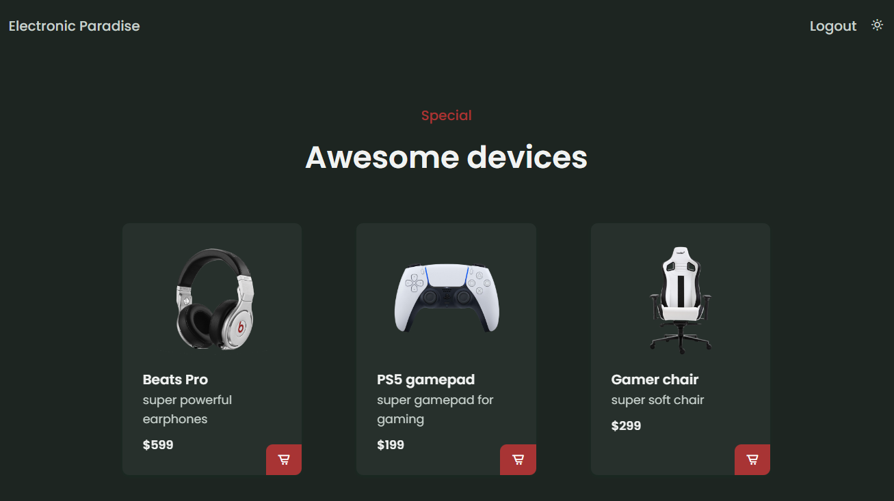
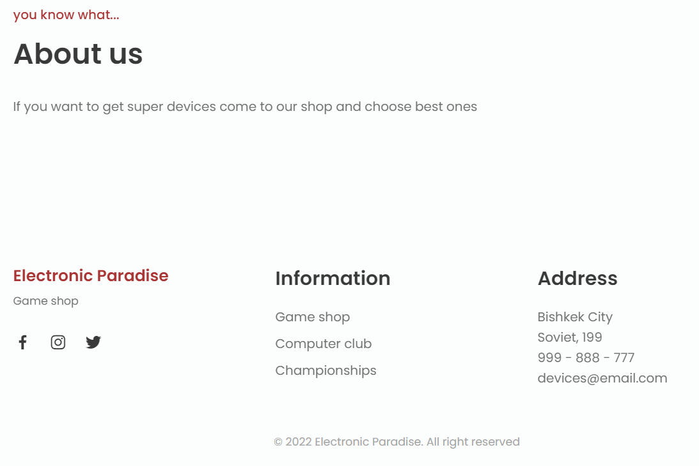
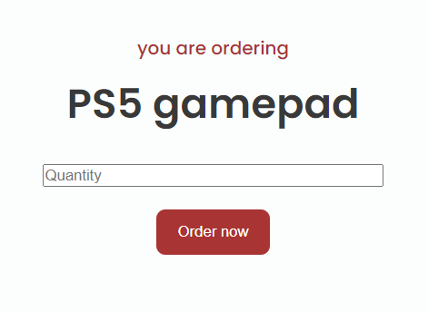

#  Devices shop using Django, Heroku, Postgresql

#### Link to Heroku https://web-final-2022.herokuapp.com/

#### Main page with list of devices

#### Dark theme

#### About us and copyright sections

#### Making order

#### Login page

#### Registration page

#### To try you have to
1. Install dependencies from requirements.txt
2. Run with "python manage.py runserver"

